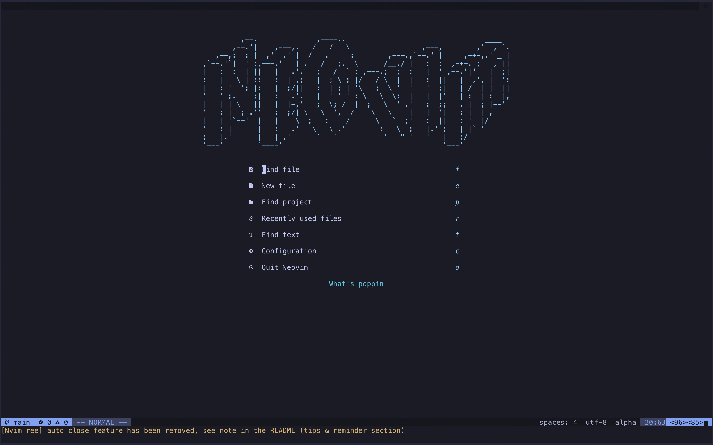
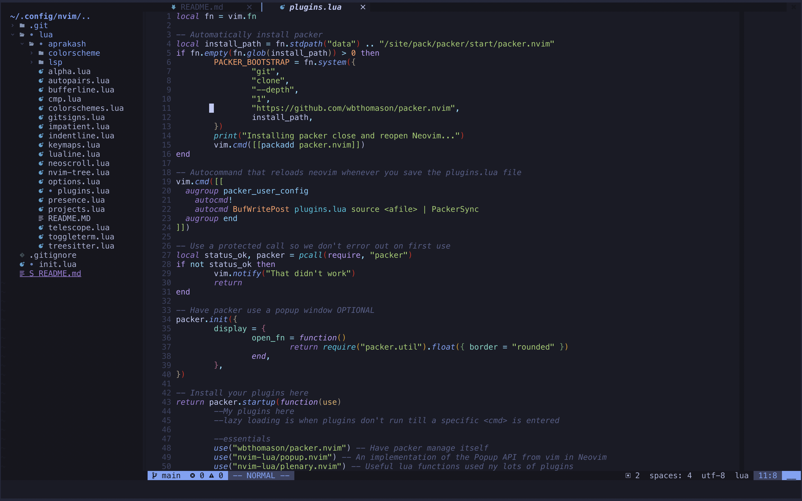
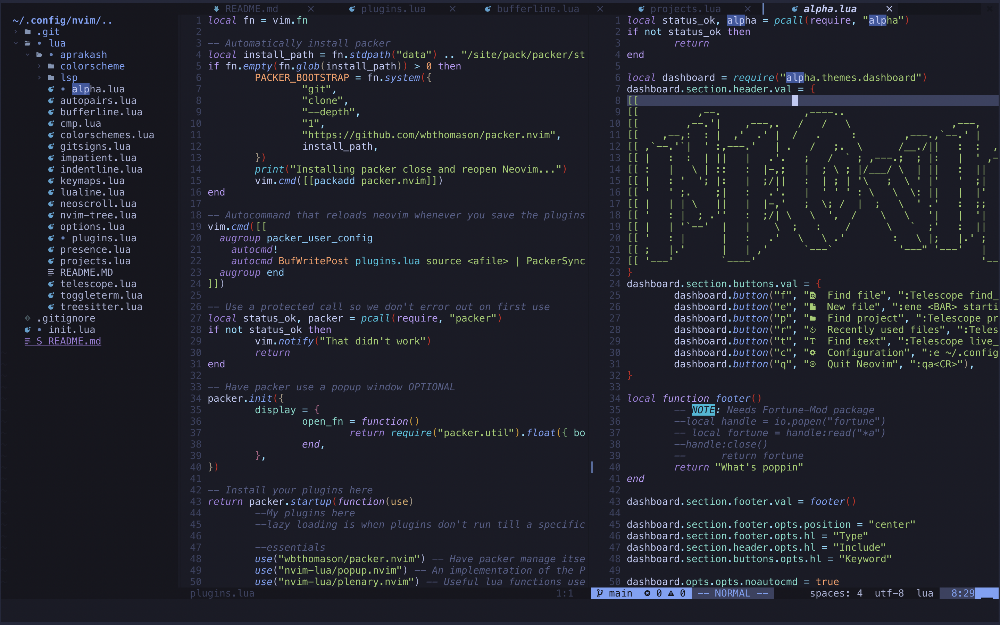
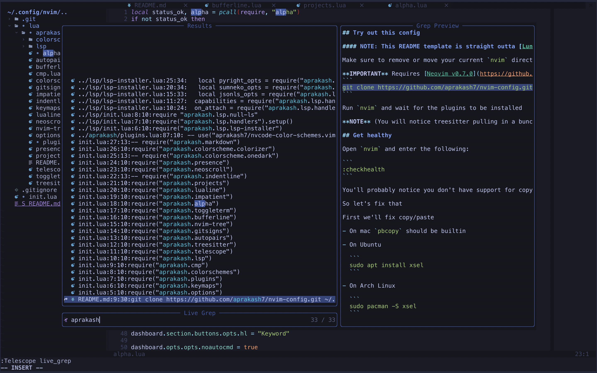
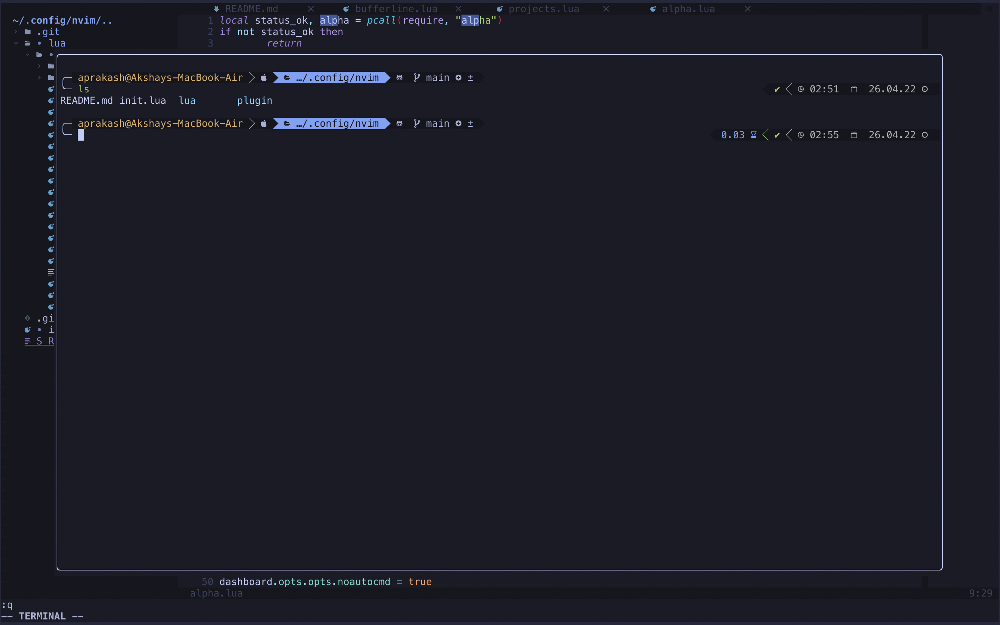
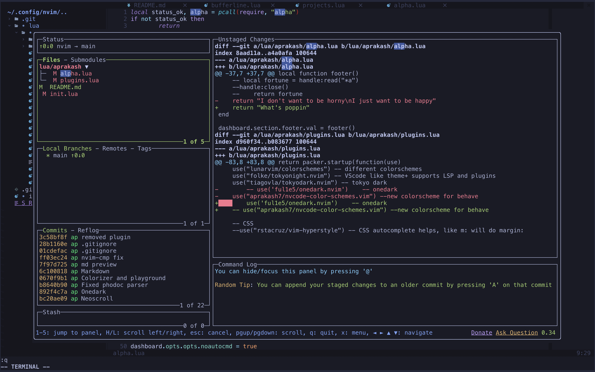
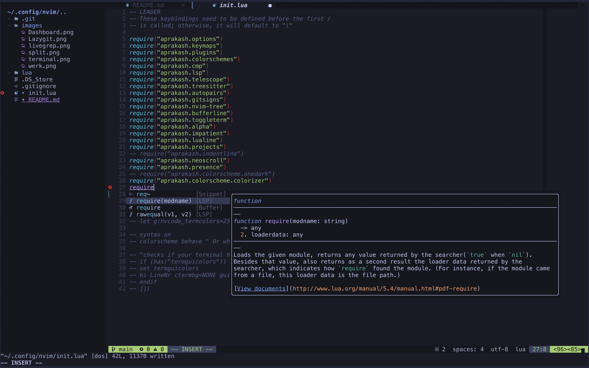

## Try out this config

### **NOTE** : This README template is straight outta [LunarVim/Neovim-from-scratch](https://github.com/LunarVim/Neovim-from-scratch/)

Make sure to remove or move your current `nvim` directory

**IMPORTANT** Requires [Neovim v0.7.0](https://github.com/neovim/neovim/releases/tag/v0.7.0) or [Nightly](https://github.com/neovim/neovim/releases/tag/nightly). 
```
git clone https://github.com/aprakash7/nvim-config.git ~/.config/nvim
```

Run `nvim` and wait for the plugins to be installed 

**NOTE** (You will notice treesitter pulling in a bunch of parsers the next time you open Neovim) 

## Get healthy

Open `nvim` and enter the following:

```
:checkhealth
```

You'll probably notice you don't have support for copy/paste also that python and node haven't been setup

So let's fix that

First we'll fix copy/paste

- On mac `pbcopy` should be builtin

- On Ubuntu

  ```
  sudo apt install xsel
  ```

- On Arch Linux

  ```
  sudo pacman -S xsel
  ```

Next we need to install python support (node is optional)

- Neovim python support

  ```
  pip install pynvim
  ```

- Neovim node support

  ```
  npm i -g neovim
  ```
---

**NOTE** make sure you have [node](https://nodejs.org/en/) installed, I recommend a node manager like [fnm](https://github.com/Schniz/fnm).

> The computing scientist's main challenge is not to get confused by the complexities of his own making. 

\- Edsger W. Dijkstra

## SCREENSHOTS:
Alpha Dashboard

Werk

Split

Telescope

Terminal

Lazygit

Diagnostics, completion, linting, formatting, gitsigns, treesitter and lots more..


I'm currently bringing [Sublime Text's Behave](https://github.com/fnky/behave-theme) to Neovim and I hope to be send a PR soon. If you are interested in checking out the unofficial version, simply install the  plugin ```'aprakash/nvcode-color-schemes.vim'``` and 
```
:colorscheme behave
```

This is a work in progress (mostly forever). Feel free to add plugins or create issues for any bugs or problems you face.
